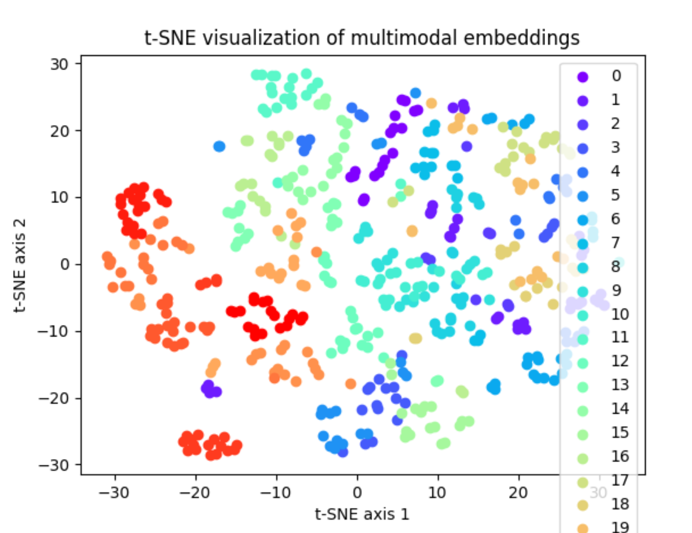
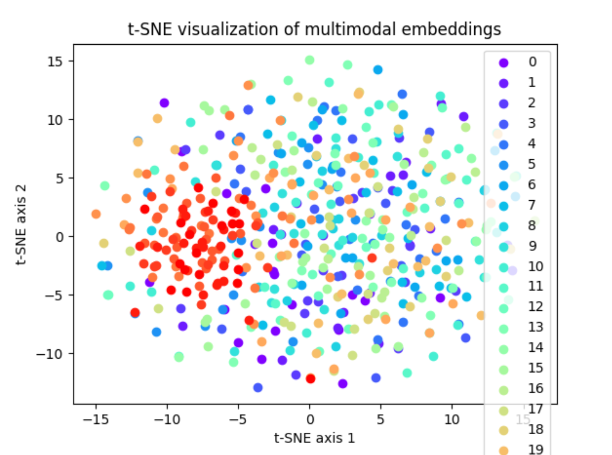

# Requirements
配置环境: 
* Python 3.9.7
* Pytorch 1.8.1
* torchvision 0.9.1
* sklearn 0.24.2
* opencv-python 4.5.5
* numpy 1.20.3

# 整体介绍
我们整体的代码核心是在FML下，CMC是一个经典的的多模态对比学习任务，可以作为集中式学习任务的一个baseline，它基于的是集中式方式去训练一个encoder，之后fine tune一个分类model，而我们是要考虑隐私保护的前提下，联邦学习式的去训练一个encoder，在集中式去训练一个分类model，但其中的算法思想可以借鉴，也减小了我们的代码工作量

我们主要分成两个阶段，重点改动FML下的代码

**第一阶段**
    
   * main_con.py文件主要是去训练一个encoder，我们要做的是将其变成联邦学习的方式，每个用户分布一些non-iid的数据，目前我的分配方式可以参考data_pre的load_niid_data函数，可以通过控制不同label数据的数量，进行用户的dataset构建，之后进行联邦学习的方式进行权重聚合，联邦的代码参考我提供的FL_dnn文件夹下的框架，比如如何构建client，如何进行模型聚合等等 
   * 我们首先将main_con.py的代码构建为联邦框架下，可以大概5-10个client，每个client构造出non-iid的数据分布，并根据我们有label的数据，新增加一个正负样本对的loss函数，再和原有的loss函数相加，训练一个联邦的encoder，这里我们现不去探讨置信度权重weight，并不对原有的loss函数做改动
   * 我们需要去验证：
        1. 我们改进后的联邦globel encoder要比***正常联邦encoder***要强（正常联邦encoder是指不加入我们各种loss方式或者在全局聚合时的一些trick，单纯的聚合client encoder模型得到的global encoder） 
        2. 我们改进后的联邦globel encoder要比单个训练client用自己的数据训练的encoder要强

                这里的更强是指：将encoder模型保存后，运行main_linear_iterative.py文件，其中main_linear_iterative.py文件是我们先前说的具有fusion功能和分类模型，但是并没有加入我们的insight，只是别人的方法先拿来用，便于检测我们的encoder有效性

        3. 我们改进后的globel encoder要比***正常联邦encoder***在高维空间的映射结果更加合理
        
                在高维空间映射更合理是指，我们用改进后全局的global encoder将所有的数据经过encoder得到feature，使用tsne进行空间映射，不同label的数据聚类明显，正如第一张图，而训练效果较差的encoder在高维空间中映射的结果非常分散，正如第二张图
            
            
        4. 我们改进后的globel encoder如果没有到达我们理想中的效果，可能就需要调参，甚至需要改动我们的loss函数，提出一种置信度权重的方式

## Project Strcuture
```
|--sample-code-UTD // sample code of each approach on the UTD dataset

 |-- FML                    // codes of our approach FML
    |-- main_con.py/	// main file of contrastive fusion learning on cloud 
    |-- main_linear_iterative.py/	// main file of supervised learning on edge
    |-- data_pre.py/		// prepare for the data
    |-- FML_design.py/ 	// fusion-based feature augmentation and contrastive fusion loss
    |-- FML_model_guide.py/	// models of unimodal feature encoders and the quality-quided attention based classifier
    |-- util.py/	// utility functions

 |-- CMC                    // codes of the baseline Contrastive Multi-view Learning (CMC)
    |-- main_con.py/	// main file of contrastive multi-view learning
    |-- main_linear_iterative.py/	// main file of supervised learning
    |-- data_pre.py/		// prepare for the data
    |-- FML_design.py/ 	//  feature augmentation and contrastive loss
    |-- FML_model_guide.py/	// models of unimodal feature encoders and the attention based classifier
    |-- util.py/	// utility functions

 |-- supervised-baselines                    // codes of the supervised learning baselines
    |-- attnsense_main_ce.py/	// main file of AttnSense
    |-- attnsense_model.py/	// models of AttnSense
    |-- deepsense_main_ce.py/	// main file of DeepSense
    |-- deepsense_model.py/	// models of DeepSense
    |-- single_main_ce.py/	// main file of single modal learning
    |-- single_model.py/	// models of single modal learning (IMU and skeleton)
    |-- data_pre.py/		// prepare for the multimodal and singlemodal data
    |-- util.py/	// utility functions
    
|--UTD-data 	// zipped folder for the processed and splited data in the UTD dataset

|-- README.md

|-- materials               // figures and materials used this README.md
```
<br>

## Quick Start
* Download the `sample-code-UTD` folder and `UTD-data.zip` to your machine, then put `UTD-data.zip` the folder `sample-code-UTD` and unzipped.
* Run the following code for our approach FML
    ```bash
    cd ./sample-code-UTD/FML/
    python3 main_con.py --batch_size 32 --label_rate 5 --learning_rate 0.01
    python3 main_linear_iterative.py --batch_size 16 --label_rate 5 --learning_rate 0.001 --guide_flag 1 --method iterative
    ```
* Run the following code for the baseline Contrastive Multi-view Learning (CMC)
    ```bash
    cd ./sample-code-UTD/CMC/
    python3 main_con.py --batch_size 32 --label_rate 5 --learning_rate 0.01
    python3 main_linear.py --batch_size 16 --label_rate 5 --learning_rate 0.001
    ```
    
* Run the following code for the supervised learning baselines
    ```bash
    cd ./sample-code-UTD/supervised-baselines/
    python3 attnsense_main_ce.py --batch_size 16 --label_rate 5 --learning_rate 0.001
    python3 deepsense_main_ce.py --batch_size 16 --label_rate 5 --learning_rate 0.001
    python3 single_main_ce.py --modality inertial --batch_size 16 --label_rate 5 --learning_rate 0.001
    python3 single_main_ce.py --modality skeleton --batch_size 16 --label_rate 5 --learning_rate 0.001
    ```
    


    
